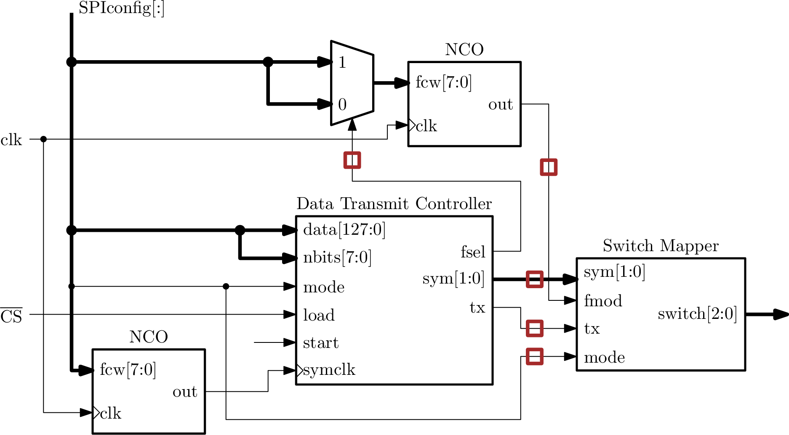

ECE 429 course project
========================
Backscatter RFID Chip
------------------------

.. rubber: clean specifications.out

.. include:: gitversion.txt

.. sectnum::
    :depth: 3

.. target-notes::

:Authors: Dan White and contributors
:Date: |date|
:Version: |version|

.. raw:: latex

    \pdfpxdimen=1in % 1 DPI
    \divide\pdfpxdimen by 96

..  \DeclareGraphicsExtensions{.pdf,.png,.jpg}

.. raw:: html

    
    
    <body onload="WaveDrom.ProcessAll()">
    <meta http-equiv="refresh" content="10"> // TEMPORARY

.. |pm| unicode:: 0xB1 .. plus-minus sign

.. |up| unicode:: 0x2191 .. up-arrow

.. |dn| unicode:: 0x2193 .. down-arrow

.. contents:: Table of Contents

.. raw:: latex

    \listoffigures
    \listoftables

================================================================
Introduction
================================================================

---------------------------------------------
Terminology
---------------------------------------------
The key words "MUST", "MUST NOT", "REQUIRED", "SHALL", "SHALL NOT", "SHOULD", "SHOULD NOT", "RECOMMENDED",  "MAY", and "OPTIONAL" in this document are to be interpreted as described in [RFC-2119]_.

.. [RFC-2119] https://www.ietf.org/rfc/rfc2119.txt

NOTE: The .rst version of this document SHALL be considered the canonical version, the .pdf is merely a convenience.
Discrepancies MUST resolve to the .rst version.

---------------------------------------------
Radio-frequency identification
---------------------------------------------
Radio-frequency identification (RFID) is a wireless communication scheme where a Reader transmits a strong signal towards a device (Tag) and the Tag responds by sending back data.
This communication from the Tag to Reader is accomplished by the Tag varying the impedance of its antenna.
The energy impinging on the Tag’s antenna is absorbed and reflected (“scattered”) in some proportion depending on the antenna’s impedance characteristics.

If the Tag changes its antenna impedance rapidly, the back-scattered energy will change also, resulting in the scattered wave having double-sideband modulation components in addition to the original frequency.
The Reader can detect these sidebands and demodulate the data that the Tag sent.

The most common method for modulating these back-scattered sidebands is to vary the frequency of the impedance changes between two frequencies.
Bits are therefore able to be assigned to each unique frequency.
In other words, the Tag switches the antenna impedance between two levels (usually open- / short-circuit) at frequency #1 or frequency #2 depending on the current bit to be sent.

Such a communication method requires extremely little power consumption on the Tag side of the link.
With careful design, the Tag can even extract enough energy from the incoming signal from the Reader to power itself and operate the antenna switch.

------------------------------------
Synchronous Serial Communication
------------------------------------
The two most common interfaces to connect peripheral devices to a central processor both use serial data connections, SPI and I2C.
It is possible, and even somewhat common, to find devices which are compatible with both formats using the same pins.

* SPI : Serial Peripheral Interface bus
* I2C : Inter-Integrated-Circuit bus

The details and timing diagrams for each of these formats are easily found on the internet.

================================================================
Project Specifications
================================================================

The project for ECE 429 is to design and layout an integrated circuit in the On Semiconductor C5N 0.5um CMOS process that implements the major subsystems of an RFID tag.
A complete design would be capable of transmitting arbitrary data on programmable backscatter channel frequencies in the 915 MHz ISM band and also possibly in the 2.4 GHz ISM band.

-----------------------------------------
Processor interface specification
-----------------------------------------
The processor interface to this chip SHALL be via an SPI slave port.
From the view of the processor, the SPI port is viewed as an **N**-bit shift register.
Updating any bit of the device's configuration requires sending the entire **N**-bit set of data in a single bus transaction.

Pins participating in the SPI interface SHALL be named:

    * *SCLK*
    * *MOSI*
    * *MISO*
    * *CS*

The chip datasheet SHALL clearly specify the SPI mode in terms of ``CPOL`` and ``CPHA`` as used in reference [WP-SPI].

.. [WP-SPI] https://en.wikipedia.org/wiki/Serial_Peripheral_Interface_Bus

Data SHALL transferred beginning with the most-significant bit of the entire bit string.
Data being returned from the slave to the master SHALL be shifted out of at the same time, also beginning with the *msb*.

Data bits that are applied to internal circuitry such as the NCO and DataOut register SHALL NOT change until the rising edge of the chip's *CS* pin.

Example of a transaction:

    #.  The Master initiates a bus transaction and shifts out the **N**-bit data string ``data0[N-1:0]`` most-significant bit first to the slave on the ``MOSI`` pin.
        The slave shifts out the current state of the data string on the ``MISO`` pin, also most-significant bit first.

        * After the rising edge of the *CS* pin, the Master will have received **N**-bits of data from the slave.

    #.  The Master initiates a second bus transaction and shifts out the **N**-bit data string ``data1[N-1:0]`` most-significant bit first to the slave on the ``MOSI`` pin.
        The slave shifts out the current state of the data string on the ``MISO`` pin, also most-significant bit first.

        * After the transaction, the Master will have again received **N**-bits of data from the slave.
        * This data MUST be identical to ``data0[N-1:0]``.

A consequence of this protocol definition is that the Slave behaves as a write-only device.
The Slave SHALL NOT send data back to the Master other than the data received from the Master in the previous bus transaction.

An asynchronous and active-low *reset* pin SHALL be provided by the chip.
At the falling edge of the *reset* pin, every register and flip-flop SHALL immediately set their *Q* outputs to a default value immediately.
This default register output state SHALL be clearly documented in the chip datasheet for EVERY register and EVERY flip-flop.

While the *reset* pin is low, every register MUST continually output the default state and ignore all input signals or clocks.
After the rising edge of the *reset* pin, the chip SHALL resume normal operation.

..  The processor interface to this chip SHALL be via an SPI slave port.
    From the view of the controlling processor, the device is a bank of up to 128 registers of 8-bits each which may be written to or read from.
    The chip datasheet MUST specify the implemented address locations and the meaning of reads and/or writes to those addresses.
    Writes to an unimplemented address SHOULD have no effect.
    Reads of unimplemented register addresses MAY return meaningless data and SHOULD be ignored by the controlling processor.

..  The chip datasheet SHALL clearly specify the SPI mode in terms of ``CPOL`` and ``CPHA`` as used in reference [WP-SPI].

..  .. [WP-SPI] https://en.wikipedia.org/wiki/Serial_Peripheral_Interface_Bus

..  There SHALL be two commands accepted by the device: *read-register* and
    *write-register*.
    For an SPI bus transaction, these commands are encoded in the first and
    most-significant bit of the first byte sent to the chip.
    *Read-register* is encoded as a ``1`` while *write-register* is encoded as a
    ``0`` value.
    The following two tables describe the protocol used for register read and write
    commands.

..  .. table:: SPI register write transaction.  ``Raddr`` is the 7-bit register address and ``Rdata`` is the 8-bit register data to be stored.

..      ============  ====================  ======================
        Pin              byte0              byte1
        ============  ====================  ======================
        Bit #:          ``76543210``        ``76543210``
        ``MOSI``       ``0[Raddr]``         ``[Rdata ]``
        ``MISO``       ``xxxxxxxx``         ``xxxxxxxx``
        ============  ====================  ======================

..  .. table:: SPI register read transaction.  ``Raddr`` is the 7-bit register address and ``Rdata`` is the 8-bit register data stored at that address.

..      ============  ====================  ======================
        Pin              byte0              byte1
        ============  ====================  ======================
        Bit #:          ``76543210``        ``76543210``
        ``MOSI``       ``1[Raddr]``         ``xxxxxxxx``
        ``MISO``       ``xxxxxxxx``         ``[Rdata ]``
        ============  ====================  ======================

..  Implementation of a serial data interface compatible with both SPI and I2C is
    OPTIONAL.

..  The chip's I2C device address MUST be within the range of valid addresses according to the I2C specification.
    The least-significant bits of the address MAY be pin-programmable, i.e. zero or more pins MAY be used to set the last address bits while the prefix bits are hard-coded to some valid value.

..  Register read or write commands SHALL follow the same format as the SPI-based
    protocol except the first byte is the I2C standard device address and
    read/write bit.
    Since the *read* or *write* command is specified in the least-significant bit
    of the first transaction byte, the chip SHALL ignore the most-significant bit
    of the register address byte.
    The following tables describe the chip's 3-byte I2C protocol.

..  .. table:: I2C register write

..      ============  ====================  ======================  =============
        Pin              byte0                   byte1               byte2
        ============  ====================  ======================  =============
        Bit #:          ``76543210``        ``76543210``            ``76543210``
        ``SDA``         ``<Daddr>0``        ``x<Raddr>``            ``<8-data>``
        ============  ====================  ======================  =============

..  .. table:: I2C register read

..      ============  ====================  ======================  =============
        Pin              byte0                   byte1               byte2
        ============  ====================  ======================  =============
        Bit #:          ``76543210``        ``76543210``            ``76543210``
        ``SDA``         ``<Daddr>1``        ``x<Raddr>``            ``<8-data>``
        ============  ====================  ======================  =============

Protocol references
*******************

    https://learn.sparkfun.com/tutorials/serial-peripheral-interface-spi

    http://www.i2cchip.com/mix_spi_i2c.html

..  http://www.nxp.com/documents/user_manual/UM10204.pdf

..  https://learn.sparkfun.com/tutorials/i2c

..  http://www.i2c-bus.org/

Other links:

    http://wavedrom.com/

    http://www.timing-diagrams.com/

------------------------------------------
Subsystem Interconnection
------------------------------------------

    Data Controller input and output signals.

------------------------------------------
Data Transmit Controller
------------------------------------------
.. sidebar:: The Data Transmit Controller will NOT be implemented on-chip for this project.

    Its functions will be handled by an external controlling processor, like an MSP430-based microcontroller, with extra off-chip pins.
    These pins are indicated by the red squares in the system block diagram.

This block SHALL accept an input data vector and configuration from the SPI interface and coordinate the sending of those bits to the modulation system made up of the NCO and switch mapper.

At the rising edge of *load* the current value of the *data[127:0]* configuration vector SHALL be captured into an internal 128-bit register.
This internal 128-bit register SHALL be used for shifting out the data.

A data packet transmission SHALL begin on the first rising edge of the *symclk* signal after a rising edge on the *start* signal.
The *start* signal SHALL remain high until the next rising edge of *symclk* which starts a packet transmission.
This timing constraint on the *start* signal MUST be clearly documented in the chip datasheet.

.. sidebar:: OPTIONAL advanced specification for the previous paragraph.
    :subtitle: Fast to slow clock domain pulse synchronization

    Background: The *start* signal is synchronized in the *clk* clock domain (that of the NCO) but the Data Transmit Controller operates in the *symclk* clock domain.
    Fortunately, *symclk* is derived from *clk* via an NCO and is therefore synchronous with the *clk* clock domain.

    ---

    Alternate specification for *start* high time:
    A data packet transmission SHALL begin on the first rising edge of the *symclk* signal after a rising edge on the *start* signal.
    The minimum high time of the *start* signal SHALL be one *clk* signal period.
    It is NOT REQUIRED that *start* remain high until the next rising edge of *symclk*.
    This timing constraint on the *start* signal MUST be clearly documented in the chip datasheet.

The *tx* output signal SHALL go high at the first edge of *symclk* after *start* goes high.
Signal *tx* SHALL remain high for the number of *symclk* periods contained in the value of the input configuration signal *nbits[7:0]* and then *tx* SHALL return low.

The internal 128-bit register SHALL perform a circular shift operation with the *reg[127]* flip-flop output connected to the *reg[0]* flip-flop's D input.
After 128 *symclk* pulses after starting a transmission triggered by *start*, the register MUST stop shifting if *start* is low.
The register SHALL contain the same data in the same order as was loaded on the last rising edge of *load*.
The net effect of this is to allow repeated transmission of the same data packet without requiring a repeated SPI transaction with identical contents.

The next data transmission SHALL NOT start until at least 128 periods of the *symclk* signal.
If there has not been another rising edge of *load*, a next rising edge of *start* SHALL initiate another data transmission with the same contents as the previous transmission cycle.
If *start* remains high by the end of a packet transmission cycle, another packet transmission SHALL start on the next edge of *symclk*.
This edge is the 129th edge counting from the first *symclk* edge after the original rising edge of *start*.

When input ``mode = 0``, the contents of the internal data register are shifted out at each rising edge of *symclk* beginning with the most-significant bit.
This signal SHALL appear at output pin *fsel*.

Output pin *fsel* SHALL be the same as the current b

This block operates in two modes,depending on the state of the *mode* signal.
When ``mode = 0`` and the signal *transmit* is ``1``, block shifts out the contents of the *data[M-1:0]* register to its output pin *symbol[0]* at each rising edged of the *symclk* signal.
Pin *symbol[1]* remains ``0`` in this mode.

.. figure:: fig/data-controller.png
    :width: 340pt

    Data Controller input and output signals.

..  /*
        This block is how to get a live-rendered WaveDrom image in the HTML
        version and a corresponding image in the TEX/PDF version.  In
        cooperation with "fig/Makefile", export the image rendered in the HTML
        version as SVG and place under the same name as the JSON version.  The
        Makefile will call Inkscape to generate a PDF for display in the pdfTEX
        output.

.. raw:: html

    

.. figure:: fig/timing-datactl-mode0
    :width: 100%

    Timing diagram for sending the top 6 bits of an 8-bit data vector.
    **NOTE:** this is only an example, using data vector of 8-bits only, the project uses a data vector of 128 bits in length.

..      </end> block for timing diagrams
    */

** *TODO* ** ``mode = 1`` description

------------------------------------------
Numerically-controlled oscillator (NCO)
------------------------------------------
A numerically-controlled oscillator forms the basis of the programmable backscatter frequency control for both channel selection and frequency-shift-keying (FSK) modulation.
The NCO SHALL use an 8-bit frequency control word *fcw[7:0]*.
The current state of the phase accumulator register and *fcw[7:0]* SHALL be added, ignoring the carry-out, and used to set the next state of the phase accumulator register.
This causes the accumulator to increment its state by the value of *fcw* at each clock cycle.

    Numerically-controlled oscillator block with input and output signals.

.. figure:: fig/nco.png
    :width: 340pt

    Numerically-controlled oscillator internal construction.

Only the most-significant bit of the phase accumulator SHALL used as the output signal.
This *out* signal is a square wave at an average frequency of:

.. math::

    f_{out} = \dfrac{\mathit{fcw}}{256} f_{clk}

The smallest change in average output frequency for the NCO is given by:

.. math::

    f_{res} = \dfrac{f_{clk}}{256}

The duty cycle is not guaranteed to be 50\% -- the high and low times may vary by |pm| 1 clock period.
See reference [WP-NCO] for more information about NCO output characteristics.

.. [WP-NCO] https://en.wikipedia.org/wiki/Numerically_controlled_oscillator

------------------------------------------
Symbol rate clock generator
------------------------------------------
This block SHALL be a second instance of the NCO.
Both NCOs SHALL be clocked from the same source and therefore operate in the same clock domain *clk*.

The 8-bit frequency control word for this NCO SHALL be provided from a separate 8-bit sub-vector of the SPI configuration data.
The output signal of this block SHALL be named *symclk* and is the source of the signal when referred to in other parts of this document.

------------------------------------------
Frequency Control Word multiplexer
------------------------------------------
In order to implement frequency-shift keying (FSK) modulation, the NCO must have its *fcw* toggled between two values.
A multiplexer SHALL switch its output between two 8-bit values *in0[7:0]* and *in1[7:0]* according to the state of input signal *sel*.
When ``sel = 0``, the *in0* vector SHALL be passed to the output.
When ``sel = 1``, the *in1* vector SHALL be passed to the output.

All input signals to the multiplexer, *in0*, *in1*, and *sel* MUST be synchronized by the same clock used to drive the NCO.

.. figure:: fig/mux-8x2.png
    :width: 340pt

    8-bit multiplexer to select between two input control words to apply to the NCO's *fcw* input port.

--------------------------------------
Switch mapper
--------------------------------------
The switch mapper translates the mode of operation (FSK, or QAM) into appropriate antenna switch states.
Switch states are translated as ``switch[x] = 0``: NMOS off, and ``switch[x] == 1``: NMOS on.

In FSK mode (``mode == 0``), the input *fmod* is directly passed to ``switch[0]`` while the other switches remain off.
For QAM mode (``mode == 1``), the 2-bit input *symbol[1:0]* determines which single switch is on and the *fmod* input is ignored.

    Switch state mapping block diagram.  See the table "Symbol to antenna switch mapping table" for the decoding.

.. table:: Symbol to antenna switch mapping table.

    ======  ======  ======  =============   =============
     mode    tx      fmod    symbol[1:0]     switch[2:0]
    ======  ======  ======  =============   =============
    ``0``   ``0``   ``X``    ``XX``          ``000``
    ``0``   ``1``   ``0``    ``XX``          ``000``
    ``0``   ``1``   ``1``    ``XX``          ``001``
    ``1``   ``X``   ``X``    ``00``          ``000``
    ``1``   ``X``   ``X``    ``01``          ``001``
    ``1``   ``X``   ``X``    ``10``          ``010``
    ``1``   ``X``   ``X``    ``11``          ``100``
    ======  ======  ======  =============   =============

------------------------------------------
Antenna switches
------------------------------------------
These switch various impedances in parallel with the antenna to vary its net impedance and thence backscatter magnitude/phase.

Three N-type switches SHALL be have their gate terminals controlled by the signals ``switch[2:0]``.
The switches SHALL have their drain terminal directly connected to the *ANT* chip pin.
Each switch transistors ``switch[2]`` and ``switch[1]`` SHALL be connected to separate resistors *R2* and *R1* of different values.
Values for these resistors SHALL be determined through discussions with Professors White and Thomas.
These resistor values SHALL be documented in the chip datasheet.
The other terminal of the resistors SHALL be connected to node *antref* which SHALL also be connected to chip pin *ANTREF*.
The source terminal of the ``switch[0]`` transistor SHALL be connected directly to the *antref* node.
Pin *ANTREF* SHALL be assumed to be nominally at the system's lowest voltage, but the pin SHALL NOT be connected internally to any other "ground-like" node.

------------------------------------------
Charge pump
------------------------------------------
Accepts antenna input and outputs semi-regulated DC.

